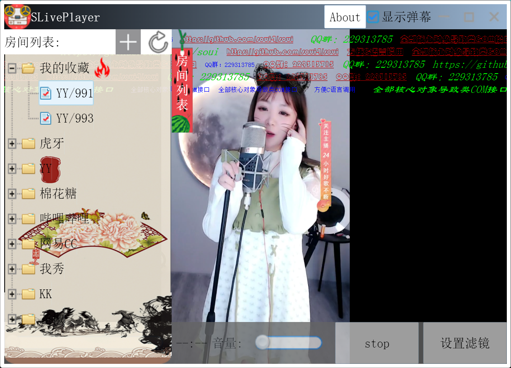

# soui4js 模块介绍
## qjsbind: 在duijs仓库的jsbind基础上改写的导出soui模块到js的bind库，目前基本满足了这个项目的需求，但是代码还不够优雅，欢迎高手继续优化。
## soui4js：这是本项目的核心模块，依赖qjsbind，将soui4的用户接口层模块全部导出到js空间。
## exctrl: 演示在js是导出soui扩展控件的模块。
## jsvodplayer：vodplayer导出到js的dll模块。
## sliveplayer: 多平台聚合直播流播放器，只作为演示soui4js使用。
## depends: 这是soui4js的依赖库
### quickjs 是作者修改后的quickjs版本，源代码：https://github.com/setoutsoft/quickjs_win 分支：windows
### sdl2, sdl2.15的预编译库。https://github.com/libsdl-org/SDL
### vodplayer, 直播播放器内核，只做demo演示，不提供源代码。
### soui4,  soui 4.4.0.5的预编译。源代码：https://github.com/soui4/soui, 注意开源协议（商用收费）

---
# 注意：
运行前先执行copy_bin.bat将依赖库复制到目标目录。